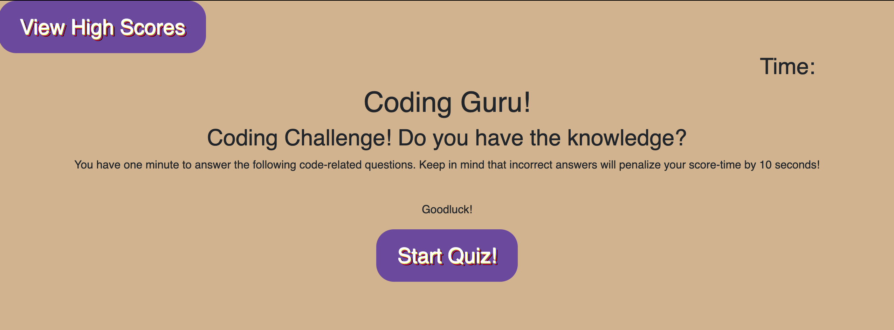

# codingguru

#### This is a site made by HTML, CSS, JavaScript, and Bootstrap 

#### Ellyse Carter

## Description
This site is a timed quiz of 5 coding questions.

If you get the answer right, it moves on to the next question and confirms that you were correct. 

If you get the answer wrong, it moves on to the next question but deducts 10 seconds from your time. 

At the end of the quiz, your time left on the quiz is your score. The quicker you finish the quiz with the correct answers, the higher your score.

At the end of the quiz, you can input your initials to save your score.

You can select the button "View High Scores" to see the high scores that are saved in the local storage. 

You can select "Clear High Scores" to clear the high score list.

You can select the "Go Back" button to start the quiz from the beginning. 

## Setup/Installation Requirements
Open terminal or a similar app on your computer and change directory to Desktop. Copy https://github.com/ellysecarter/codingguru.git.  Use git clone and paste that link after it to clone the repository.  Open the folder it provides. Open the HTML folder inside. You can also go to this link to see the full site https://ellysecarter.github.io/codingguru/

## Known Bugs
The final score does not show on the end quiz button page. 

The time does not deduct 10 seconds at the last question if you get it wrong. 

I did not have enough time to add to my local storage and save high scores. 

Go back button was working but now cannot go to home screen like it originally did. 

## Contact Details
email: ellysecarter@yahoo.com

Technologies Used
HTML CSS JavaScript

